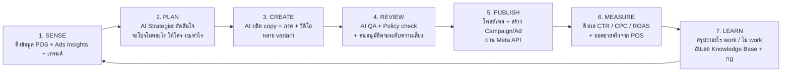
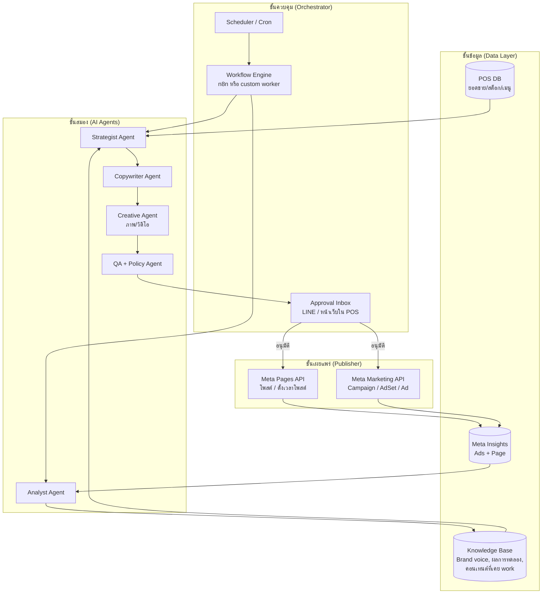

# AI Automation Full-Loop สำหรับ FB Ads / Content Ads / Post

เอกสารออกแบบระบบ (Design Doc) สำหรับทำการตลาดบน Facebook แบบ **ครบวงจรอัตโนมัติ**
ตั้งแต่ "รู้ว่าจะขายอะไร" → "สร้างคอนเทนต์/แอด" → "โพสต์และยิงแอด" → "วัดผล" → "เรียนรู้แล้ววนกลับไปใหม่"
โดยผูกกับข้อมูลจริงจาก POS (ยอดขาย / สต็อก / เมนูขายดี) ของร้าน

---

## 1. Full Loop คืออะไร (ภาพรวม)



หลักคิดสำคัญ 3 ข้อ

1. **AI ทำงานซ้ำ ๆ คนตัดสินใจเรื่องเสี่ยง** งบเล็ก/โพสต์ธรรมดาให้ AI ทำเองได้ งบใหญ่/โปรโมชั่นราคาต้องมีคนกด Approve
2. **ทุกอย่างต้องวัดผลได้และย้อนกลับได้** ทุก creative ต้องมี ID เชื่อมถึงผลลัพธ์ และมีปุ่ม "หยุดทุกอย่าง" (kill switch)
3. **Loop ต้องปิดที่ยอดขายจริง ไม่ใช่แค่ยอด Like** ใช้ข้อมูล POS เป็นตัววัดสุดท้าย ไม่ใช่แค่ metric จาก Facebook

---

## 2. สถาปัตยกรรมระบบ



### 2.1 องค์ประกอบแต่ละส่วน

| ส่วน | หน้าที่ | ตัวเลือกเครื่องมือ |
|---|---|---|
| POS DB | แหล่งความจริงเรื่องยอดขาย เมนูขายดี สต็อกเหลือ | ต่อจาก thai-sme-pos (ตอนนี้เป็น state ในหน้าเว็บ ต้องย้ายลง DB เช่น Supabase / PostgreSQL) |
| Meta Insights | ผลแอด (impressions, CTR, CPC, CPA, ROAS) และผลโพสต์ (reach, engagement) | Meta Marketing API `/insights`, Page Insights หรือดึงผ่าน Supermetrics |
| Knowledge Base | จำว่าแบรนด์พูดยังไง คอนเทนต์แบบไหนเคย work กฎที่เรียนรู้มา | Postgres + pgvector หรือ Notion DB ที่ AI อ่านได้ |
| Strategist Agent | ตัดสินใจ "สัปดาห์นี้/วันนี้โปรโมทอะไร งบเท่าไร กลุ่มไหน" ออกมาเป็น Brief | LLM API พร้อม tool ให้อ่าน POS + KB |
| Copywriter Agent | เขียน caption / headline / primary text / CTA หลาย variant เป็นภาษาไทยตาม brand voice | LLM API |
| Creative Agent | สร้างภาพจาก template (ใส่รูปเมนู + ราคา + โปร) หรือ gen ภาพ/วิดีโอสั้น | Canva API, Bannerbear, Placid (template) / image gen model / Remotion (วิดีโอ) |
| QA + Policy Agent | เช็ค: สะกด, ราคาถูกต้องตรงกับ POS, ไม่ผิดนโยบายโฆษณา Meta, ไม่ hallucinate โปรที่ไม่มีจริง | LLM API + rule engine |
| Analyst Agent | อ่านผลแอด + ยอดขาย สรุป insight, เสนอ scale/kill, อัปเดต KB | LLM API + SQL |
| Orchestrator | รันตามเวลา จัดคิว retry เก็บ log ทุกขั้น | n8n (เริ่มง่าย) หรือ Node/TS worker + BullMQ (คุมได้เต็มที่) |
| Approval Inbox | ให้เจ้าของร้านกดอนุมัติ/แก้/ปฏิเสธจากมือถือ | LINE Notify/Messaging API หรือหน้า "Marketing" ในแอป POS |
| Publisher | ยิงจริงเข้า Facebook | Meta Graph API (Pages) + Marketing API |

---

## 3. Data Model (สิ่งที่ต้องเก็บ)

```ts
// Brief = คำสั่งจาก Strategist ว่าจะทำอะไร
interface Brief {
  id: string;
  createdAt: string;
  objective: 'awareness' | 'engagement' | 'traffic' | 'conversion' | 'store_visit';
  type: 'organic_post' | 'boosted_post' | 'ad_campaign';
  product: { menuItemId: string; name: string; price: number };   // ผูกกับ POS
  reason: string;              // ทำไมเลือกอันนี้ เช่น "ขายดีอันดับ 1 สัปดาห์นี้ + สต็อกเยอะ"
  audience: AudienceSpec;      // อายุ / พื้นที่ / interest / custom audience
  budgetTHB?: number;          // ต่อวัน
  durationDays?: number;
  angle: string;               // มุมเล่า เช่น "เช้าเร่งรีบ", "ของหวานหลังเลิกงาน"
  riskLevel: 'low' | 'medium' | 'high';   // กำหนดว่าต้องมีคนอนุมัติไหม
}

// ContentPiece = ชิ้นงาน 1 variant
interface ContentPiece {
  id: string;
  briefId: string;
  variant: string;             // A / B / C
  hook: string;
  primaryText: string;
  headline?: string;
  cta?: 'LEARN_MORE' | 'ORDER_NOW' | 'GET_DIRECTIONS' | 'MESSAGE_PAGE';
  imageUrl?: string;
  videoUrl?: string;
  hashtags: string[];
  qa: { passed: boolean; issues: string[] };
  status: 'draft' | 'pending_approval' | 'approved' | 'rejected' | 'published';
}

// Placement = ของที่ยิงจริงบน Meta
interface Placement {
  id: string;
  contentId: string;
  fbPostId?: string;
  fbCampaignId?: string;
  fbAdSetId?: string;
  fbAdId?: string;
  publishedAt: string;
  scheduledAt?: string;
}

// Experiment = ผูก variant หลายตัวเข้าด้วยกันเพื่อเทียบ
interface Experiment {
  id: string;
  briefId: string;
  hypothesis: string;          // "รูปแบบ hook คำถาม จะได้ CTR ดีกว่า hook บอกราคา"
  placements: string[];
  metric: 'ctr' | 'cpc' | 'cpa' | 'roas' | 'pos_sales_lift';
  decision?: 'scale' | 'kill' | 'iterate';
  learnedRule?: string;        // สิ่งที่สรุปได้ เขียนกลับเข้า KB
}

// InsightSnapshot = ผลที่ดึงมาทุกวัน
interface InsightSnapshot {
  placementId: string;
  date: string;
  impressions: number; reach: number; clicks: number; spendTHB: number;
  ctr: number; cpc: number; cpa?: number; roas?: number;
  posSalesOfProduct: number;   // ยอดขายจริงของเมนูนั้นในวันนั้นจาก POS
}
```

---

## 4. รายละเอียดแต่ละขั้นของ Loop

### 4.1 SENSE – ดึงข้อมูล (ทุกวัน 06:00)

- จาก POS: ยอดขายราย SKU ย้อนหลัง 7 / 30 วัน, สต็อกที่เหลือ, เมนูใหม่, ช่วงเวลาขายดี
- จาก Meta: ผลของทุก placement ที่ยัง active
- จากภายนอก (optional): วันหยุด, อากาศ, เทศกาล, เทรนด์ (เช่น "Dubai chocolate")
- ผลลัพธ์: ตาราง `daily_context` 1 แถวต่อวัน ที่ Strategist อ่านได้

### 4.2 PLAN – Strategist ออก Brief (ทุกวัน 07:00 + ทุกวันจันทร์วางแผนสัปดาห์)

กฎตัดสินใจที่ให้ AI ใช้ (เขียนเป็น prompt + tool)

| สัญญาณจาก POS | Action ที่ควรออก |
|---|---|
| เมนูขายดีขึ้น 3 วันติด | Organic post โชว์ + boost งบเล็ก |
| สต็อกวัตถุดิบเหลือเยอะ ใกล้หมดอายุ | โปรโมชั่นเมนูที่ใช้วัตถุดิบนั้น (ต้องคนอนุมัติเพราะกระทบราคา) |
| ยอดขายช่วงบ่ายตก | คอนเทนต์ "afternoon treat" ตั้งเวลาโพสต์ 13:30 |
| เมนูใหม่เพิ่งเพิ่มใน POS | ชุด launch: teaser → เปิดตัว → รีวิว |
| แอดตัวไหน ROAS > เป้า 2 วันติด | เสนอ scale งบ +20% |
| แอดตัวไหน CPA แย่กว่าเป้า 1.5 เท่า 2 วันติด | เสนอ kill และทำ variant ใหม่ |

Output: 1-3 Brief ต่อวัน ไม่เกิน N ต่อสัปดาห์ (กันสแปม)

### 4.3 CREATE – ผลิตคอนเทนต์

- Copywriter สร้าง **3 variant ต่อ Brief** โดยบังคับให้ต่างกันเชิงโครงสร้าง (hook แบบคำถาม / บอกราคา / เล่าเรื่อง)
- Creative เลือก template ตามประเภท (โพสต์เมนู / โปรโมชั่น / เปิดตัว) แล้วเรนเดอร์ภาพ 1:1 และ 4:5 อัตโนมัติ ใส่รูปเมนูจาก POS
- ทุกชิ้นต้องแนบ `briefId` เพื่อตามผลย้อนกลับได้
- Brand voice เก็บใน KB เป็นเอกสาร 1 หน้า: โทน, คำที่ใช้/ห้ามใช้, emoji policy, ตัวอย่างโพสต์ที่ชอบ 10 อัน

### 4.4 REVIEW – QA และอนุมัติ

QA อัตโนมัติ (ต้องผ่านทุกข้อ)

1. ราคา/ชื่อเมนูตรงกับ POS จริง (query กลับไปเช็ค)
2. ไม่มีคำอ้างที่ห้าม เช่น "ดีที่สุด", "รักษาโรค", "ลด 100%" ตามนโยบายโฆษณา Meta
3. ความยาวไม่เกิน limit ของ placement (primary text 125 ตัวอักษรแรกต้องมี hook)
4. ภาพมี text ไม่เกินสัดส่วนที่เหมาะ
5. ไม่ซ้ำกับโพสต์ 14 วันล่าสุด (เทียบ embedding)

ระดับการอนุมัติ

| riskLevel | เงื่อนไข | ใครอนุมัติ |
|---|---|---|
| low | Organic post ไม่พูดถึงราคาโปร | Auto-publish (แจ้งใน LINE ให้รู้เฉย ๆ) |
| medium | Boost / แอด งบ ≤ 300 บาท/วัน | Auto-publish ได้ถ้าเปิดโหมด autopilot ไม่งั้นรอคนกด |
| high | โปรโมชั่นราคา, งบ > 300/วัน, เมนูใหม่ | ต้องคนกดอนุมัติเสมอ |

### 4.5 PUBLISH – ยิงจริง

- Organic post: `POST /{page-id}/photos` หรือ `/feed` พร้อม `scheduled_publish_time`
- Ad: สร้างตามลำดับ Campaign → AdSet (targeting, budget, schedule) → AdCreative → Ad โดยตั้งสถานะ `PAUSED` ก่อน แล้วค่อย activate หลังเช็คว่าสร้างครบ
- ตั้งชื่อทุก object ด้วย convention เช่น `[AI][brief-2026-09-06-01][A]` เพื่อดึงผลกลับมาจับคู่ได้
- เก็บ ID ที่ Meta คืนมาลง `Placement` ทันที

### 4.6 MEASURE – ดึงผล (ทุก 6 ชั่วโมง)

- `/{ad-id}/insights?fields=impressions,reach,clicks,spend,ctr,cpc,actions`
- จับคู่กับยอดขาย POS ของเมนูนั้นในวันเดียวกัน → คำนวณ `pos_sales_lift` เทียบ baseline 7 วันก่อนหน้า
- ทำ dashboard ในแอป POS (ใช้ recharts ที่มีอยู่แล้ว) แสดง: งบใช้ไป, ยอดขายที่เพิ่ม, creative ที่ดีที่สุด

### 4.7 LEARN – สรุปและวนกลับ (ทุกวัน 22:00 + สรุปสัปดาห์)

Analyst ทำ 3 อย่าง

1. **ตัดสินทุก Experiment ที่ครบ 3 วัน**: scale / kill / iterate ตามกฎที่ตั้งไว้ (คนตั้ง threshold ได้)
2. **เขียน learned rule เข้า KB** เช่น "hook แบบคำถาม CTR สูงกว่า 30% สำหรับ Bakery" โดยเก็บพร้อมหลักฐาน (experiment id, ตัวเลข)
3. **สรุปให้เจ้าของร้าน 1 ข้อความ** ทาง LINE: ใช้งบไปเท่าไร ได้อะไรกลับมา พรุ่งนี้จะทำอะไร

Strategist รอบถัดไปจะอ่าน KB นี้ก่อนออก Brief ทุกครั้ง = loop ปิดสมบูรณ์

---

## 5. Guardrails ที่ต้องมีตั้งแต่วันแรก

- **Budget cap รวม** ต่อวัน/เดือน ที่ระบบห้ามเกินไม่ว่า AI จะเสนออะไร
- **Kill switch** ปุ่มเดียวหยุดทุกแอด (`status=PAUSED` ทั้ง account) ส่งจาก LINE ได้
- **Rate limit การโพสต์** เช่น ไม่เกิน 2 โพสต์/วัน
- **Audit log** ทุกการตัดสินใจของ AI เก็บ input/output/reason
- **Fallback** ถ้า LLM ล่ม หรือ Meta API error → หยุดและแจ้งคน ไม่ retry แบบสร้าง campaign ซ้ำ (ใช้ idempotency key = briefId+variant)
- **Token/permission** ของ Meta เก็บใน secret manager ใช้ System User token ที่ไม่หมดอายุ

---

## 6. สิ่งที่ต้องเตรียมฝั่ง Meta

1. Facebook Page + Business Manager + Ad Account
2. Meta App (Business type) ขอ permission: `pages_manage_posts`, `pages_read_engagement`, `ads_management`, `ads_read`, `business_management`
3. ผ่าน App Review สำหรับ `ads_management` (ใช้ Dev mode ทดสอบกับ admin ของตัวเองได้ก่อน)
4. System User token แบบ never-expire
5. Meta Pixel / Conversions API ถ้าจะวัด conversion ออนไลน์ (ถ้าเป็นหน้าร้านล้วน ใช้ POS lift แทน)

---

## 7. ทางเลือก Tech Stack ตามระดับความพร้อม

### Level 1 – Low-code เริ่มได้ใน 1-2 สัปดาห์
- n8n (self-host) เป็น orchestrator + cron
- LLM API เป็น agent ทุกตัว (ใช้ prompt แยกตาม role)
- Canva / Bannerbear template สร้างภาพ
- Google Sheets หรือ Notion เป็น KB + Approval queue
- LINE Notify แจ้งเตือน/อนุมัติผ่านลิงก์
- โพสต์ผ่าน n8n Facebook node, แอดผ่าน HTTP node เรียก Marketing API

### Level 2 – Custom service (แนะนำสำหรับ thai-sme-pos)
- Backend: Node.js + TypeScript (ภาษาเดียวกับ repo) + Fastify
- Queue/cron: BullMQ + Redis
- DB: PostgreSQL + pgvector (POS data + marketing tables + KB)
- Agents: LLM API พร้อม tool use ต่อ SQL/Meta API โดยตรง
- Frontend: เพิ่ม view `Marketing` ในแอป POS (Approval inbox, dashboard, kill switch)
- Deploy: Docker บน VPS เดียว

### Level 3 – Scale หลายสาขา/หลายเพจ
- แยก worker ต่อเพจ, multi-tenant, RBAC
- Creative pipeline วิดีโอ (Remotion)
- Bayesian bandit สำหรับกระจายงบระหว่าง variant อัตโนมัติ

---

## 8. Roadmap แนะนำ

| Phase | ระยะเวลา | ทำอะไร | เกณฑ์ผ่าน |
|---|---|---|---|
| 0 Foundation | 1-2 สัปดาห์ | ย้าย POS data ลง DB, ตั้ง Meta App + token, เขียน brand voice doc, ตั้ง budget cap | ดึงยอดขาย + ดึง insights ได้จาก script |
| 1 Half-loop (Organic) | 2 สัปดาห์ | SENSE → PLAN → CREATE → REVIEW(คนอนุมัติทุกอัน) → PUBLISH โพสต์ธรรมดา | โพสต์ AI ออกได้ 5 โพสต์/สัปดาห์ โดยคนแก้ < 20% |
| 2 Measure + Learn | 2 สัปดาห์ | เก็บ insight, dashboard, Analyst สรุปรายวัน, KB เริ่มมี rule | มีอย่างน้อย 5 learned rule พร้อมหลักฐาน |
| 3 Paid loop | 3-4 สัปดาห์ | Boost + Ad campaign งบเล็ก, experiment A/B/C, scale/kill อัตโนมัติ (medium risk) | CPA ดีขึ้นเทียบ manual, ไม่มีเคสงบเกิน cap |
| 4 Autopilot | ต่อเนื่อง | ค่อย ๆ ขยายสิ่งที่ auto ได้ตาม track record, เพิ่มวิดีโอ, หลายเพจ | เจ้าของร้านใช้เวลา < 15 นาที/วัน |

---

## 9. KPI ที่ใช้วัดว่าระบบ "สำเร็จ"

- เวลาที่เจ้าของร้านใช้กับการตลาดต่อสัปดาห์ (เป้า: ลดจากหลายชั่วโมงเหลือ < 1 ชม.)
- สัดส่วนคอนเทนต์ที่ผ่านโดยไม่ต้องแก้ (เป้า > 80%)
- CPA / ROAS เทียบก่อนใช้ระบบ
- POS sales lift ของเมนูที่ถูกโปรโมท เทียบ baseline
- จำนวน learned rule ที่ถูกนำไปใช้จริงในรอบถัดไป (พิสูจน์ว่า loop ปิดจริง)

---

## 10. โครงสร้างโค้ดที่เสนอ (ถ้าทำ Level 2 ใน repo นี้)

```
thai-sme-pos/
├── src/                      # POS frontend เดิม + view Marketing ใหม่
└── server/
    └── marketing/
        ├── sense/            # posCollector.ts, metaInsightsCollector.ts
        ├── plan/             # strategist.ts, rules.ts
        ├── create/           # copywriter.ts, creative.ts, templates/
        ├── review/           # qa.ts, policyRules.ts, approval.ts
        ├── publish/          # metaPages.ts, metaMarketing.ts
        ├── measure/          # insights.ts, attribution.ts
        ├── learn/            # analyst.ts, knowledgeBase.ts
        ├── jobs/             # cron definitions + BullMQ workers
        ├── db/               # schema.sql, migrations
        └── guardrails/       # budgetCap.ts, killSwitch.ts, auditLog.ts
```

ขั้นถัดไปที่แนะนำให้เริ่มก่อน: Phase 0 (ย้าย POS data ลง DB + ต่อ Meta API ให้ดึง insights ได้) เพราะเป็นฐานของทุก loop

---

## 11. Mockup UI

หน้าจอต้นแบบแบบ interactive (mock data, หลายร้านค้า, ปรับได้ทุกค่า) อยู่ที่ `docs/mockup/loopdesk.html`
เปิดไฟล์ในเบราว์เซอร์ได้โดยตรง ไม่ต้อง build มี 7 หน้า: ภาพรวม / Loop / คิวอนุมัติ / แคมเปญ / ช่องทาง (Facebook, TikTok, Shopee, LINE) / AI Agents / ตั้งค่า

---

## 12. Module Map (จาก research เครื่องมือในตลาด)

เทียบจาก 3 กลุ่มเครื่องมือ: Ads automation (Madgicx, Revealbot), Social management (Metricool, Vista Social) และ Chat commerce (Manychat) รวมกับ GMV Max ของ TikTok Shop / Shopee ได้โมดูลทั้งหมด 15 ตัว แบ่ง 3 กลุ่ม

### กลุ่ม A · ฐานราก (ต้องมีก่อนทุกอย่าง)

| # | โมดูล | ทำอะไร | ข้อมูลหลัก | อ้างอิงจาก |
|---|---|---|---|---|
| 1 | Store & Team | หลายร้าน หลายผู้ใช้ บทบาท (เจ้าของ / แอดมิน / ทีมขายส่ง) audit log แพ็กเกจ | Store, User, Role, AuditEvent | Vista Social (team), Revealbot (audit log) |
| 2 | Connectors | เชื่อม Facebook Page + Ads, TikTok + Shop, Shopee, LINE OA, POS/Bigseller · token, สิทธิ์รายความสามารถ | Connection, Token, Capability | ทุกแพลตฟอร์ม |
| 3 | Catalog & Stock | SKU แยกทรง/สี/ไซส์ sync ไป FB Catalog, TikTok Shop, Shopee · กฎ "ไซส์ขายดีหมด = หยุดโฆษณา" | Product, Variant(size,color), StockLevel, SyncStatus | Bigseller + GMV Max ต้องใช้ catalog |
| 4 | Knowledge Base | brand voice, USP ของเพจ, คำต้องห้าม, กฎที่เรียนรู้พร้อมหลักฐาน, โพสต์ที่เคย work | BrandDoc, LearnedRule, PastPost(embedding) | ไม่มีในตลาดแบบตรง ๆ เป็นจุดต่างของเรา |

### กลุ่ม B · Loop ประจำวัน

| # | โมดูล | ทำอะไร | อ้างอิงจาก |
|---|---|---|---|
| 5 | Data Hub (SENSE) | ดึงยอดขาย POS, insights แอด/เพจ ทุกช่องทาง ทุก 6 ชม. | Metricool (รวม paid + organic ในที่เดียว) |
| 6 | Strategist (PLAN) | ออก Brief วันละ 1-3 ชิ้น จากยอดขาย สต็อกรายไซส์ และ KB | Madgicx AI (แต่เราผูกกับ POS) |
| 7 | Creative Studio (CREATE) | copy หลาย hook + template ภาพ/วิดีโอ + คลังไฟล์ + Creative Cockpit ดูว่า hook ไหน work | Madgicx Creative Cockpit, Predis |
| 8 | Review & Approval | QA ราคา/ไซส์/นโยบาย + คิวอนุมัติตามความเสี่ยง | ไม่มีในตลาด (จุดต่าง) |
| 9 | Publisher & Calendar | ตั้งเวลาโพสต์ ปฏิทินรายสัปดาห์ เวลาที่ reach ดี โควตาโพสต์ | Metricool / Vista Social calendar |
| 10 | Campaign Manager & Rules | สร้าง/พัก/scale แอด · กฎ if-then (ROAS, CPA, frequency, วันที่รัน) · ต่อ GMV Max | Revealbot rules, TikTok GMV Max, Shopee GMV Max ROI |
| 11 | Analyst & Reports | จับคู่แอดกับยอดขาย POS (lift), digest LINE รายวัน, รายงานสัปดาห์ PDF/Excel | Metricool reports |

### กลุ่ม C · เติบโต

| # | โมดูล | ทำอะไร | อ้างอิงจาก |
|---|---|---|---|
| 12 | Chat & Comment Automation | คอมเมนต์ → ทักแชท → ตอบไซส์/ราคา/COD → เปิดออเดอร์ → ส่งต่อคนเมื่อเคลม/ขายส่ง | Manychat comment trigger + Messenger flow (ไทยซื้อผ่านแชทเป็นหลัก) |
| 13 | Audience & CRM | segment จากแชท/ออเดอร์ (ทักแล้วไม่ซื้อ, เคยซื้อ, พ่อค้าแม่ค้า) sync เป็น custom audience / lookalike · PDPA | Madgicx AI Audiences |
| 14 | Competitor Watch | ติดตามเพจยีนส์อื่นจาก Ad Library: จำนวนแอด hook ราคา → AI เสนอ Brief โต้ | Metricool / Vista competitor tracking |
| 15 | Experiments Lab | A/B/C ต่อ Brief, ตัดสินอัตโนมัติเมื่อครบวันทดสอบ (ฝังอยู่ใน 10 + 11) | Madgicx |

## 13. ลำดับการสร้าง (ทำอะไรก่อนหลัง)

หลักคิด: สร้างสิ่งที่ **เห็นข้อมูลจริงและลดงานเจ้าของร้านได้เร็วที่สุด** ก่อน และให้ AI ลงมือทำเองทีหลังสุด

| ลำดับ | สัปดาห์ | สร้าง | ได้อะไร | ยังไม่ทำ |
|---|---|---|---|---|
| 1 | 1-2 | Connectors (Facebook Page + Ads อ่านอย่างเดียว) + Catalog & Stock (นำเข้าจาก Bigseller/POS) + Knowledge Base (เอกสาร brand 1 หน้า) | Dashboard เห็นยอดขาย สต็อกรายไซส์ และผลแอดจริงในที่เดียว | ยังไม่โพสต์ ไม่ยิงแอด |
| 2 | 3-4 | Data Hub + Analyst (digest LINE รายคืน + attribution กับ POS) | ทุกคืนรู้ว่าแอดตัวไหนคุ้ม สินค้าไหนขาดไซส์ ใช้เวลา 0 นาที | ยังไม่สร้างคอนเทนต์ |
| 3 | 5-6 | Creative Studio + Review & Approval + Publisher (organic เท่านั้น) | AI ร่างโพสต์ตามสไตล์เพจ คนกดอนุมัติจากมือถือ ระบบโพสต์ให้ | ยังไม่ใช้งบ |
| 4 | 7-9 | Campaign Manager & Rules + Strategist | boost/แอดงบเล็ก มีกฎ scale/kill และ cap · loop ปิดครบ 7 ขั้น | ยังไม่ตอบแชท |
| 5 | 10-12 | Chat & Comment Automation + Audience & CRM | คอมเมนต์ถูกทักแชทและตอบไซส์อัตโนมัติ เปิดออเดอร์ COD retarget คนทักแล้วไม่ซื้อ | |
| 6 | 13+ | TikTok Shop + Shopee connectors (GMV Max), Competitor Watch, Calendar เต็มรูปแบบ, Store & Team หลายร้าน + แพ็กเกจ | ขยายไปทุกช่องทางและขายเป็น SaaS ให้ร้านอื่น | |

ทำไมเรียงแบบนี้

- **Catalog & Stock ต้องมาก่อน Creative** เพราะร้านยีนส์ล้มเหลวที่ "ยิงแอดสินค้าที่ไซส์หมด" กฎนี้ต้องมีตั้งแต่โพสต์แรก
- **Analyst มาก่อน Strategist** เพราะ AI ต้องมีข้อมูลผลจริงและ learned rule ก่อนถึงจะวางแผนได้ดีกว่าคน
- **Organic ก่อน Paid** เพื่อสร้างความไว้ใจในสไตล์การเขียนของ AI โดยไม่เสียเงิน แล้วค่อยเปิดงบ
- **Chat ทีหลัง Loop** แม้จะมีค่ามาก เพราะต้องขอสิทธิ์ Messenger เพิ่มและผ่าน App Review ทำคู่ขนานกับข้อ 3-4 ได้ถ้ามีคนสองคน

Mockup ทุกโมดูลอยู่ที่ `docs/mockup/loopdesk.html` เมนูแบ่ง 3 กลุ่มตามตารางด้านบน
