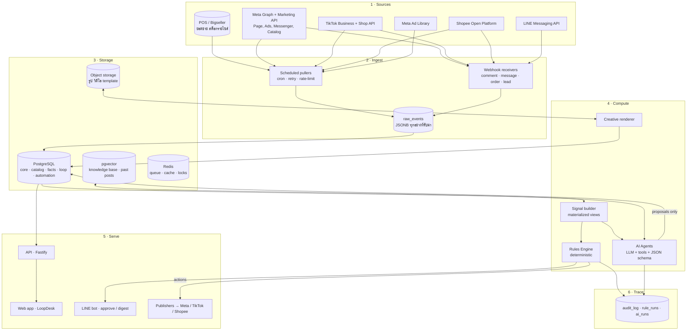
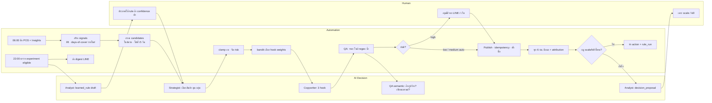

# Data Architecture · LoopDesk (Climax by PKjeans)

เอกสารนี้ตอบ 2 คำถามก่อนลงมือสร้าง

1. **งานไหนใช้ Automation (กฎ / cron / API ที่คาดเดาผลได้) และงานไหนต้องให้ AI คิด** และงานไหนคนต้องเคาะ
2. **ข้อมูลไหลจากไหนไปไหน เก็บที่ไหน ใครอ่าน ใครเขียน** เพื่อให้ AI ทำงานบนข้อมูลที่ถูกต้องและย้อนกลับได้ทุกการตัดสินใจ

---

## 1. หลักการแยกงาน 3 ชั้น

| ชั้น | ใช้เมื่อ | ตัวอย่าง | คุณสมบัติ |
|---|---|---|---|
| **Automation** (Rules / Jobs / API) | เขียนเป็น if-then ได้ ผลลัพธ์เดียวกันทุกครั้ง ตรวจสอบย้อนหลังได้ | ดึงข้อมูล, คำนวณ ROAS, เช็คราคาตรง POS, โพสต์ตามเวลา, พักแอดเมื่อ CPA เกิน | เร็ว ถูก ไม่ผิดเพี้ยน ต้องมี unit test |
| **AI Decision** (LLM Agents) | ต้องอ่านบริบท เขียนภาษา เลือกจากตัวเลือกที่ไม่มีสูตร หรือสรุปสิ่งที่เรียนรู้ | เลือกว่าโปรโมทอะไร มุมไหน, เขียน caption, ตอบแชทที่ไม่ตรง keyword, สรุป rule จากผลทดลอง | ยืดหยุ่น แต่ต้องมี schema ควบคุม output และวัดคุณภาพ |
| **Human** | เสี่ยงเงิน เสี่ยงแบรนด์ หรือกระทบราคา/ลูกค้าโดยตรง | อนุมัติงบ > เกณฑ์, โปรราคา, ตอบเคลม, ปิดการขายขายส่ง | ต้องเห็นเหตุผลของ AI และกดได้จากมือถือ |

กฎทอง 3 ข้อของสถาปัตยกรรมนี้

- **AI ไม่เขียนลง fact tables** AI เขียนได้แค่ "ข้อเสนอ" (brief, content, decision proposal, learned_rule draft) ส่วนการลงมือทำจริงเป็นหน้าที่ของ Automation หลังผ่านกฎหรือคน
- **Automation ตัดสินใจเรื่องเงินตามกฎที่คนตั้ง** AI เสนอได้ภายในกรอบ (เช่น งบ ≤ cap, scale ≤ +20%) แต่ตัวเลขสุดท้ายมาจากสูตร
- **ทุกการตัดสินใจมี trace** ai_runs เก็บ prompt / input snapshot / output / cost, rule_runs เก็บกฎที่ยิงและผล, audit_log เก็บว่าใครทำอะไร

---

## 2. ตารางแยกงาน: Automation vs AI vs Human

### 2.1 Loop ประจำวัน

| ขั้น | งาน | ประเภท | Trigger | Input | Output |
|---|---|---|---|---|---|
| SENSE | ดึงยอดขาย/สต็อกจาก POS-Bigseller | Automation | cron ทุก 15 นาที | API / Excel export | `fact_sales_daily`, `stock_level` |
| SENSE | ดึง insights แอดและเพจทุกช่องทาง | Automation | cron ทุก 6 ชม. | Meta / TikTok / Shopee API | `fact_ad_insight_daily`, `fact_post_insight_daily` |
| SENSE | คำนวณ baseline, lift, days-of-cover รายไซส์ | Automation | หลัง ingest | fact tables | `mv_product_signal` (materialized view) |
| SENSE | ตรวจความผิดปกติ (ยอดตก > 30%, token ใกล้หมด, API error) | Automation | หลัง ingest | signals | event `anomaly.detected` → แจ้ง LINE |
| PLAN | กรองสินค้าที่ "โฆษณาได้" (ไซส์ขายดีครบ, สต็อก ≥ 6/ไซส์, ไม่โพสต์ซ้ำใน 5 วัน) | Automation | 07:00 | `mv_product_signal`, `content_piece` | `candidate_products` |
| PLAN | เลือกสินค้า มุมเล่า กลุ่มเป้าหมาย ช่องทาง จาก candidates | **AI** Strategist | หลัง candidates | candidates + `learned_rule` + KB | `brief` (JSON schema) |
| PLAN | กำหนดงบและระยะเวลา | Automation | หลัง brief | cap, ROAS history, risk | `brief.budget` (AI เสนอ, สูตร clamp) |
| PLAN | จัดระดับความเสี่ยง low/medium/high | Automation | หลัง brief | กฎใน settings | `brief.risk_level` |
| CREATE | เขียน caption / headline / script ต่างกัน 3 hook | **AI** Copywriter | หลัง brief | brief + brand_doc + top past_posts | `content_piece[]` |
| CREATE | เลือก template และน้ำหนัก hook | Automation (bandit) | ก่อน AI เขียน | `mv_hook_performance` | hook weights |
| CREATE | เรนเดอร์ภาพ 1:1 / 4:5 / 9:16 จาก template + รูปสินค้า | Automation | หลัง copy | template + assets | `asset` (S3 url) |
| REVIEW | ราคา ชื่อ ไซส์ที่อ้าง ตรงกับ POS | Automation | หลัง create | content vs catalog | `qa_result` |
| REVIEW | คำต้องห้าม (regex) + ความยาว + จำนวน emoji | Automation | หลัง create | forbidden list | `qa_result` |
| REVIEW | ซ้ำโพสต์ 14 วัน (cosine ≥ 0.92) | Automation | หลัง create | embedding | `qa_result` |
| REVIEW | ผิดนโยบายโฆษณาเชิงความหมาย (อ้างผลรูปร่าง, เทียบแบรนด์) | **AI** QA | เฉพาะที่ผ่าน regex | policy doc | `qa_result.semantic` |
| REVIEW | อนุมัติ | Human / Automation ตาม risk | หลัง QA | approval matrix | `approval` |
| PUBLISH | โพสต์ / สร้าง campaign-adset-ad / ตั้งเวลา / ตั้งชื่อ / idempotency | Automation | หลัง approved | content + brief | `placement` (external ids) |
| MEASURE | ดึงผล + จับคู่ยอดขาย POS ช่วงยิง vs baseline | Automation | cron ทุก 6 ชม. | facts | `mv_placement_performance` |
| MEASURE | scale / kill ตามกฎ (ROAS ≥ X n วัน, CPA > เป้า×1.5 n วัน, งบไม่เกิน cap) | Automation Rules Engine | หลังคำนวณ | rules + performance | `rule_run` → action |
| MEASURE | กรณีก้ำกึ่ง (ROAS ดีแต่ lift ไม่ขึ้น, ตัวเลขขัดกัน) | **AI** Analyst | เมื่อกฎไม่ชี้ขาด | performance + context | `decision_proposal` → คน |
| LEARN | ตรวจว่า experiment มีนัยสำคัญพอ (n ≥ 2 variant, ≥ 3 วัน, spend ≥ 500) | Automation | 22:00 | experiments | `experiment.eligible` |
| LEARN | สรุปเป็น learned rule 1 ประโยค + หลักฐาน | **AI** Analyst | เฉพาะ eligible | experiment stats | `learned_rule` (status=draft) |
| LEARN | ประกาศใช้ rule | Automation (auto ถ้า confidence สูง) / Human | หลัง draft | threshold | `learned_rule.status=active` |
| LEARN | ส่งสรุปรายวัน | Automation (template) + **AI** (5 บรรทัดสรุป) | 22:00 | digest view | LINE push |

### 2.2 โมดูลอื่น

| โมดูล | งาน | ประเภท |
|---|---|---|
| Chat | ตรวจ keyword (ไซส์ / ราคา / COD / ขายส่ง / เคลม) และเลือก flow | Automation |
| Chat | แนะนำไซส์จากส่วนสูง/น้ำหนัก | Automation (size table lookup) + **AI** เรียบเรียงประโยค |
| Chat | ตอบคำถามเปิด ต่อรอง หรือไม่ตรง keyword | **AI** ร่าง → Human ส่ง (หรือ auto ถ้า confidence ≥ 0.9 และไม่ใช่เคลม) |
| Chat | เปิดออเดอร์ COD จากแชท (ดึงสินค้า ไซส์ สี ที่อยู่ เบอร์) | **AI** extract เป็น JSON → Automation validate กับ catalog → Human ยืนยัน |
| Chat | ซ่อนคอมเมนต์ที่มีเบอร์โทร / ส่งต่อคนเมื่อโกรธ | Automation (regex) + **AI** sentiment |
| Catalog | sync SKU ไป FB Catalog / TikTok Shop / Shopee, ปิดแอดเมื่อไซส์ขายดีหมด | Automation |
| Catalog | เสนอโปรระบายสต็อกค้าง > 60 วัน | Automation ตรวจ → **AI** เขียนโปร → Human อนุมัติ (กระทบราคา) |
| Audience | สร้าง segment จาก events (ทักแล้วไม่ซื้อ, เคยซื้อ, พ่อค้าแม่ค้า) และ sync แบบ hash | Automation |
| Audience | เสนอ segment ใหม่ / lookalike | **AI** เสนอ → Human เปิด |
| Competitor | ดึง Ad Library รายวัน นับแอด เก็บข้อความ | Automation |
| Competitor | สรุป hook คู่แข่ง เสนอ Brief โต้ | **AI** |
| Calendar | จัดเวลาตาม heatmap reach และโควตา | Automation |
| Reports | รวมตัวเลขรายสัปดาห์ export PDF/Excel | Automation |
| Guardrails | budget ledger, kill switch, rate limit, idempotency, token renewal | Automation เท่านั้น (AI แตะไม่ได้) |

สัดส่วนโดยประมาณ: งาน **70% เป็น Automation**, **20% เป็น AI**, **10% เป็นคน** และเงินทุกบาทผ่าน Automation + คนเท่านั้น

---

## 3. สถาปัตยกรรมข้อมูล (Layers)



หลักการของแต่ละชั้น

- **Ingest แยกจาก Storage** ทุกอย่างที่รับจากภายนอกลง `raw_events` ก่อนเสมอ (JSONB + source + received_at) แล้วค่อย normalize เป็นตาราง เพื่อ replay ได้เมื่อ schema เปลี่ยนหรือ parser ผิด
- **Facts เป็น append-only** ตาราง `fact_*` ไม่แก้ย้อนหลัง มี `snapshot_date` ทำให้เทียบ "ที่ AI เห็นตอนตัดสินใจ" กับ "ความจริงวันนี้" ได้
- **AI อ่านจาก views ไม่ใช่ตารางดิบ** ทุก agent รับ input เป็น JSON ที่สร้างจาก materialized view ที่ตั้งชื่อชัด (`mv_product_signal`, `mv_placement_performance`, `mv_hook_performance`) ทำให้ควบคุมได้ว่า AI เห็นอะไร และ replay การตัดสินใจได้
- **Proposal tables คั่นกลาง** `brief`, `content_piece`, `decision_proposal`, `learned_rule` เป็นที่ AI เขียน ส่วน `placement`, `rule_run`, `order` เป็นที่ Automation เขียนหลังผ่านการอนุมัติ

---

## 4. Schema หลัก (PostgreSQL)

ทุกตารางมี `tenant_id`, `store_id`, `created_at`, `updated_at` (ตัดออกจากตัวอย่างเพื่อให้อ่านง่าย)

### 4.1 Core & Connectors

```sql
create table tenant   (id uuid primary key, name text, plan text);
create table store    (id uuid primary key, tenant_id uuid, name text, type text, timezone text default 'Asia/Bangkok');
create table app_user (id uuid primary key, tenant_id uuid, name text, line_user_id text, email text);
create table membership (user_id uuid, store_id uuid, role text check (role in ('owner','admin','sales','viewer')), primary key (user_id, store_id));

create table connection (
  id uuid primary key, store_id uuid,
  channel text check (channel in ('facebook','tiktok','shopee','line','pos')),
  external_account_id text, display_name text,
  capabilities jsonb,            -- {"post":true,"ads":true,"insights":true,"messages":false}
  token_ref text,                -- อ้างอิง secret manager ไม่เก็บ token ในตาราง
  token_expires_at timestamptz, status text, last_sync_at timestamptz
);
```

### 4.2 Catalog & Stock (หัวใจของร้านยีนส์)

```sql
create table product (
  id uuid primary key, store_id uuid, sku_group text,     -- PK-กระบอกเล็ก
  name text, category text, base_price numeric(10,2),
  set_price jsonb,                                         -- {"qty":3,"price":550}
  is_promotable boolean default true
);
create table variant (
  id uuid primary key, product_id uuid,
  color text, size text,                                   -- ดำ / 32
  sku text unique,                                         -- [ประเภท]-[สถานที่]-[สี]-[ขนาด] ตาม Bigseller
  price numeric(10,2)
);
create table stock_level (
  variant_id uuid, location text, qty int, snapshot_at timestamptz,
  primary key (variant_id, location, snapshot_at)
);
create table channel_listing (
  variant_id uuid, connection_id uuid, external_item_id text,
  listed_price numeric(10,2), status text, last_synced_at timestamptz,
  primary key (variant_id, connection_id)
);
create table size_rule (                                   -- กฎไซส์ขายดีต่อหมวด
  store_id uuid, category text, core_sizes text[],         -- {'30','32','34'}
  min_qty_per_size int default 6
);
```

### 4.3 Facts (append-only)

```sql
create table fact_sales_daily (
  store_id uuid, date date, variant_id uuid, channel text,  -- pos | facebook_chat | shopee | tiktok_shop
  qty int, revenue numeric(12,2), primary key (store_id, date, variant_id, channel)
);
create table fact_ad_insight_daily (
  placement_id uuid, date date,
  impressions int, reach int, clicks int, spend numeric(12,2),
  conversations int, purchases int, revenue numeric(12,2),
  raw jsonb, primary key (placement_id, date)
);
create table fact_post_insight_daily (
  placement_id uuid, date date, reach int, engagement int, comments int, shares int, video_views_50 int,
  primary key (placement_id, date)
);
create table conversation (
  id uuid primary key, store_id uuid, connection_id uuid, external_thread_id text,
  customer_ref text, source text,        -- comment | messenger | tiktok_comment | shopee_chat
  placement_id uuid, tags text[],        -- {'wholesale','size_question'}
  state text, last_message_at timestamptz
);
create table message (
  id uuid primary key, conversation_id uuid, direction text, -- in | out
  author text,                                              -- customer | ai | human
  text text, intent text, confidence numeric(4,3), sent_at timestamptz
);
create table customer_order (
  id uuid primary key, store_id uuid, conversation_id uuid,
  items jsonb,                                              -- [{variant_id, qty, price}]
  payment text, ship_to jsonb, status text,                 -- draft | confirmed | shipped | returned
  external_order_id text                                    -- ส่งเข้า POS/Bigseller แล้ว
);
```

### 4.4 Loop (proposal → execution)

```sql
create table brief (
  id uuid primary key, store_id uuid, date date,
  objective text, type text, product_id uuid, channel text,
  audience jsonb, angle text, reason text,
  budget_thb numeric(10,2), duration_days int, risk_level text,
  ai_run_id uuid, status text                                -- proposed | approved | rejected | published
);
create table content_piece (
  id uuid primary key, brief_id uuid, variant text, hook_type text,
  primary_text text, headline text, cta text, hashtags text[],
  asset_ids uuid[], ratio text,
  embedding vector(1536), ai_run_id uuid,
  qa jsonb, status text                                       -- draft | qa_failed | pending_approval | approved | rejected | published
);
create table approval (
  id uuid primary key, content_id uuid, mode text,            -- auto | notify | require
  decided_by text, decided_at timestamptz, decision text, note text
);
create table placement (
  id uuid primary key, content_id uuid, connection_id uuid,
  kind text,                                                  -- organic_post | boosted_post | ad
  external_ids jsonb,                                         -- {post_id, campaign_id, adset_id, ad_id}
  idempotency_key text unique,                                -- brief_id + variant + kind
  scheduled_at timestamptz, published_at timestamptz, status text
);
create table experiment (
  id uuid primary key, brief_id uuid, hypothesis text, metric text,
  placement_ids uuid[], starts_on date, min_days int, status text, decision text
);
create table decision_proposal (                              -- AI เสนอ, กฎ/คนตัดสิน
  id uuid primary key, placement_id uuid, proposed_action text, -- scale | kill | iterate
  proposed_value jsonb, reason text, ai_run_id uuid, status text
);
```

### 4.5 Knowledge

```sql
create table brand_doc   (store_id uuid, key text, content text, updated_by text, primary key (store_id, key)); -- voice, usp, forbidden, policy
create table learned_rule (
  id uuid primary key, store_id uuid, rule text, evidence jsonb, -- {experiment_id, n, days, metric, delta}
  confidence numeric(4,3), status text,                          -- draft | active | retired
  applies_to jsonb, ai_run_id uuid                               -- {"channel":"facebook","category":"ผู้ชาย"}
);
create table past_post (placement_id uuid primary key, text text, embedding vector(1536), performance jsonb);
```

### 4.6 Automation & Trace

```sql
create table rule (
  id uuid primary key, store_id uuid, name text, scope text,     -- placement | stock | chat | budget
  condition jsonb,        -- {"all":[{"metric":"roas","op":">=","value":3,"days":2},{"metric":"budget_used_pct","op":"<","value":80}]}
  action jsonb,           -- {"type":"scale_budget","pct":20,"max_daily":1500}
  enabled boolean, created_by text
);
create table rule_run   (id uuid primary key, rule_id uuid, target_id uuid, fired_at timestamptz, matched jsonb, action_taken jsonb, result text);
create table ai_run (
  id uuid primary key, store_id uuid, agent text, model text,
  input_snapshot jsonb,   -- JSON ที่ AI เห็นจริง ณ ตอนนั้น
  output jsonb, schema_valid boolean, tokens_in int, tokens_out int, cost_thb numeric(8,4), latency_ms int
);
create table budget_ledger (store_id uuid, date date, channel text, committed numeric(12,2), spent numeric(12,2), cap numeric(12,2), primary key (store_id, date, channel));
create table audit_log (id bigserial primary key, store_id uuid, actor text, actor_type text, action text, target text, before jsonb, after jsonb, at timestamptz default now());
create table raw_event (id bigserial primary key, source text, kind text, payload jsonb, received_at timestamptz default now(), processed_at timestamptz);
```

---

## 5. Event model (ใครส่ง ใครรับ)

ใช้ Redis Streams / BullMQ เป็น bus ทุก event มี `store_id`, `event_id`, `occurred_at`, `payload`

| Event | ผู้ส่ง | ผู้รับ (ประเภท) |
|---|---|---|
| `sales.ingested` | POS puller | Signal builder (Automation) |
| `stock.core_size_out` | Signal builder | Rules: พักแอดสินค้านั้น (Automation), แจ้ง LINE |
| `stock.aging_over_60d` | Signal builder | Strategist (AI) ใส่เป็น candidate โปรระบาย |
| `insight.ingested` | Ads puller | Performance builder → Rules Engine |
| `rule.fired` | Rules Engine | Publisher (Automation), audit |
| `brief.created` | Strategist (AI) | Copywriter (AI), Budget clamp (Automation) |
| `content.created` | Copywriter | QA (Automation → AI), Renderer |
| `content.qa_passed` | QA | Approval router (Automation) |
| `content.approved` | Human / Approval router | Publisher |
| `placement.published` | Publisher | Calendar, Measure scheduler |
| `experiment.eligible` | Learn scheduler | Analyst (AI) |
| `learned_rule.activated` | Human / auto | Strategist (อ่านรอบถัดไป) |
| `comment.received` / `message.received` | Webhook | Chat router (Automation) → Chat agent (AI) หรือ Human |
| `order.drafted` | Chat agent | Catalog validator (Automation) → Human confirm → POS sync |
| `anomaly.detected` | Signal builder / pullers | LINE notify, pause autopilot ถ้าเป็น API error ซ้ำ |
| `kill_switch.pressed` | Human | Publisher: pause ทุก placement, disable autopilot |

---

## 6. Data flow ประจำวัน แยกเลนตามผู้ตัดสินใจ



---

## 7. สัญญาข้อมูลสำหรับ AI (Data Contracts)

ทุก agent มี 3 สิ่งที่ตายตัว

1. **Input view** ชื่อ view ที่อ่านและ field ที่เห็น (ไม่ให้ AI query อิสระใน production)
2. **Output JSON schema** validate ก่อนบันทึก ไม่ผ่านให้ retry 1 ครั้งแล้วส่งให้คน
3. **Budget** token สูงสุดต่อ run และค่าใช้จ่ายต่อวันต่อร้าน

| Agent | Input view | Output schema | เครื่องมือที่ให้ใช้ |
|---|---|---|---|
| Strategist | `mv_product_signal` (สินค้า ยอด 7/30 วัน trend สต็อกรายไซส์ core_size_ok aging_days), `learned_rule` active, `budget_ledger` วันนี้ | `Brief[] (max 3)` | `search_kb`, `get_past_posts(product_id)` |
| Copywriter | `brief`, `brand_doc`, `past_post` top-5 ของสินค้าเดียวกัน, hook weights | `ContentPiece[] (= variants)` | `search_kb` |
| QA (semantic) | `content_piece`, `brand_doc.policy` | `{passed, issues[]}` | ไม่มี |
| Analyst | `mv_placement_performance`, `experiment`, `fact_sales_daily` ช่วงที่เกี่ยว | `DecisionProposal` หรือ `LearnedRule` | `run_sql_readonly` (whitelist views) |
| Chat | `conversation` + 10 ข้อความล่าสุด, `product` + `stock_level` ของสินค้าในโพสต์, `size_rule` | `{reply, intent, confidence, order_draft?}` | `lookup_size(height,weight)`, `get_stock(variant)` |

ตัวอย่าง output schema ของ Strategist (ย่อ)

```json
{
  "type": "array", "maxItems": 3,
  "items": {
    "type": "object",
    "required": ["product_id","channel","objective","angle","reason","audience","proposed_budget_thb","hook_hint"],
    "properties": {
      "product_id": {"type":"string"},
      "channel": {"enum":["facebook","tiktok","shopee"]},
      "objective": {"enum":["awareness","engagement","messages","conversion"]},
      "angle": {"type":"string","maxLength":80},
      "reason": {"type":"string","maxLength":200},
      "audience": {"type":"object"},
      "proposed_budget_thb": {"type":"number","minimum":0},
      "hook_hint": {"enum":["question","set_price","fit_all_sizes","proof","story"]}
    }
  }
}
```

---

## 8. Guardrails ที่อยู่ในชั้นข้อมูล (ไม่ใช่ใน prompt)

| Guardrail | ทำงานที่ | กลไก |
|---|---|---|
| งบไม่เกิน cap | `budget_ledger` + Publisher | ก่อนสร้าง/scale แอด ต้อง `committed + new ≤ cap` ใน transaction เดียว |
| ไม่สร้างแอดซ้ำ | `placement.idempotency_key unique` | retry กี่ครั้งก็ได้ placement เดียว |
| ไม่โฆษณาสินค้าไซส์หมด | `size_rule` + Rules Engine | event `stock.core_size_out` → pause ภายใน 15 นาที |
| AI ไม่แตะเงิน | สิทธิ์ DB | role ของ agent เขียนได้เฉพาะ proposal tables |
| ย้อนรอยได้ทุกอย่าง | `ai_run.input_snapshot`, `rule_run`, `audit_log` | เก็บ JSON ที่ AI เห็นจริง ไม่ใช่แค่ prompt template |
| Kill switch | `store.autopilot=false` + job `pause_all` | ปุ่มเดียวจาก LINE/เว็บ ทุก publisher เช็ค flag ก่อนทำงาน |
| PDPA | `customer_ref` เป็น hash, ที่อยู่เก็บเฉพาะเมื่อมีออเดอร์ | sync audience แบบ SHA-256 เท่านั้น |
| Token หมดอายุ | `connection.token_expires_at` | เตือน 14 วัน, หยุด publisher เมื่อ < 1 วัน |

---

## 9. Tech stack ที่สอดคล้องกับสถาปัตยกรรมนี้

| ชั้น | เลือกใช้ | เหตุผล |
|---|---|---|
| ภาษา / API | Node.js + TypeScript + Fastify | ภาษาเดียวกับ POS frontend, SDK ครบทุกแพลตฟอร์ม |
| DB | PostgreSQL 16 + pgvector | ตารางธุรกรรม + analytics + embedding ในตัวเดียว ลดระบบ |
| Queue / Events | Redis + BullMQ | cron, retry, rate-limit ต่อ connection, streams เป็น event bus |
| Storage | Cloudflare R2 / S3 | รูป วิดีโอ template |
| Rules Engine | json-rules-engine หรือเขียนเอง (~300 บรรทัด) | condition/action เป็น JSON ใน DB แก้จากหน้าเว็บได้ |
| AI | LLM API พร้อม tool use + JSON schema output | ทุก run ผ่าน wrapper ที่บันทึก `ai_run` |
| Creative | Bannerbear / Placid หรือ Satori + Sharp | เรนเดอร์จาก template แบบ deterministic |
| LINE | LINE Messaging API | อนุมัติ / digest / kill switch |
| Secrets | Doppler / Vault / env ของ platform | token ไม่อยู่ใน DB |
| Deploy | Docker Compose บน VPS 1 เครื่อง (เริ่ม) | api + worker + postgres + redis |

---

## 10. ลำดับสร้างชั้นข้อมูล (สอดคล้อง Phase ในเอกสารหลัก)

1. **Core + Connectors + Catalog + raw_event + facts** (สัปดาห์ 1-2) ยังไม่มี AI เลย ได้ dashboard ข้อมูลจริง
2. **Signal builder + Rules Engine + budget_ledger + audit** (สัปดาห์ 3-4) ได้ digest และ alert ไซส์หมด
3. **Proposal tables + ai_run + Copywriter/QA + approval** (สัปดาห์ 5-6) organic เท่านั้น
4. **placement + experiment + decision_proposal + Strategist/Analyst** (สัปดาห์ 7-9) loop ปิด
5. **conversation/message/order + Chat agent + audience** (สัปดาห์ 10-12)

ทุกขั้นเพิ่มตารางโดยไม่แก้ตารางเดิม เพราะ facts เป็น append-only และ AI อ่านผ่าน views
