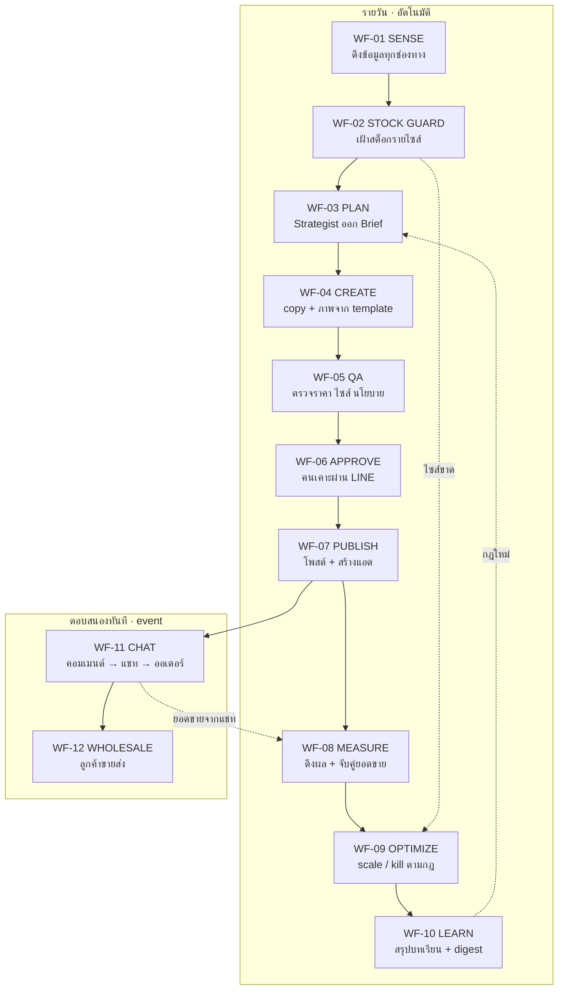

# Template Workflow ทั้งหมด · LoopDesk

เอกสารสำหรับอธิบาย Partner ว่าระบบ AI Automation ของเราทำงานเป็น **workflow แบบ template** อย่างไร
ไม่ใช่ "AI คิดเองทั้งหมด" และไม่ใช่ "คนทำเองทั้งหมด" แต่เป็นชุดขั้นตอนที่ออกแบบไว้ล่วงหน้า
มีจุดที่ AI คิด จุดที่ระบบทำตามกฎ และจุดที่คนเคาะ ชัดเจนทุกจุด

เคสตัวอย่างตลอดเอกสาร: **กางเกงยีนส์ชาย Climax by PKjeans** (ผู้ติดตาม 44,000 · ขายผ่านแชท + เก็บเงินปลายทาง + ขายส่ง)

---

## 1. "Workflow Template" คืออะไร และทำไมต้องเป็น template

ปัญหาของการใช้ AI การตลาดแบบทั่วไป คือสั่งครั้งเดียวได้งานครั้งเดียว พอทำซ้ำผลไม่เหมือนเดิม
ตรวจสอบย้อนหลังไม่ได้ และไม่มีใครรับผิดชอบเมื่อผิดพลาด

เราจึงแปลงทุกงานการตลาดให้เป็น **Workflow Template** ซึ่งมีโครงเดียวกัน 8 ช่อง

| ช่อง | ความหมาย | ตัวอย่าง |
|---|---|---|
| **Trigger** | อะไรทำให้ workflow เริ่ม | เวลา 07:00 / สต็อกไซส์ 32 หมด / ลูกค้าคอมเมนต์ |
| **Input** | ข้อมูลที่ระบบดึงมาใช้ (ระบุ view ชัดเจน) | ยอดขาย 7 วัน + สต็อกรายไซส์ + กฎที่เรียนรู้ |
| **Steps** | ลำดับขั้น แต่ละขั้นระบุว่าใครทำ | 6 ขั้น: 4 ขั้นระบบ 1 ขั้น AI 1 ขั้นคน |
| **Owner** | ใครรับผิดชอบผลลัพธ์ | ระบบ / AI agent / เจ้าของร้าน |
| **Guardrail** | เงื่อนไขที่ห้ามข้าม | งบห้ามเกิน cap · ห้ามโฆษณาสินค้าไซส์ขาด |
| **Output** | ผลลัพธ์ที่จับต้องได้ | โพสต์ที่ตั้งเวลาแล้ว + record ในฐานข้อมูล |
| **SLA** | ใช้เวลาเท่าไร | 3 นาที 40 วินาที |
| **Failure** | ถ้าพังทำอย่างไร | retry 2 ครั้ง → แจ้ง LINE → หยุด ไม่เดาต่อ |

ประโยชน์ต่อ Partner

1. **ราคาและขอบเขตงานประเมินได้** เพราะรู้ว่ามีกี่ workflow แต่ละอันใช้เวลาเท่าไร
2. **ขายซ้ำได้** ร้านใหม่ใช้ template ชุดเดียวกัน เปลี่ยนแค่ข้อมูลสินค้าและ brand voice
3. **ตรวจสอบได้** ทุกการทำงานมี log ว่า trigger อะไร ใครตัดสิน ผลเป็นอย่างไร

---

## 2. แผนที่ workflow ทั้งหมด (12 templates)



**เส้นทึบ** คือลำดับการทำงานปกติ **เส้นประ** คือ feedback ที่ทำให้ระบบฉลาดขึ้นเรื่อย ๆ
จุดสำคัญคือ WF-10 เขียนกฎกลับไปให้ WF-03 ใช้ และ WF-11 ส่งยอดขายจริงกลับไปให้ WF-08 วัดผล

---

## 3. Workflow Template รายตัว

### WF-01 · SENSE — ดึงข้อมูลเข้าระบบ

| | |
|---|---|
| **Trigger** | ทุก 6 ชั่วโมง (00:00 / 06:00 / 12:00 / 18:00) + POS ทุก 15 นาที |
| **Owner** | ระบบ (Automation 100%) |
| **SLA** | 41 วินาที |

**ขั้นตอน**

1. `[ระบบ]` ดึงยอดขายและสต็อกจาก Bigseller / POS แยกรายไซส์
2. `[ระบบ]` ดึงข้อมูลเพจจาก Facebook: ผู้ติดตาม โพสต์ reach engagement
3. `[ระบบ]` ดึงผลแอดรายวัน: impression, click, spend, ทักแชท, ยอดซื้อ
4. `[ระบบ]` เก็บ response ดิบทั้งหมดลงตาราง `raw_event` ก่อน แล้วค่อยแปลงเป็นตาราง fact
5. `[ระบบ]` คำนวณ signal ต่อสินค้า: ยอด 7/30 วัน แนวโน้ม days-of-cover สต็อกรายไซส์

**ทำไมต้องเก็บ raw ก่อน** ถ้าวันหนึ่งเราพบว่าแปลงข้อมูลผิด เราเล่นย้อนหลังใหม่ได้ทั้งหมด
โดยไม่ต้องไปขอข้อมูลจาก Facebook ใหม่ ซึ่งดึงย้อนหลังได้จำกัด

**Failure** API ล้มเหลว retry 2 ครั้งแบบ exponential backoff → ยังไม่ได้ให้บันทึก error ที่ตาราง connection
และแจ้ง LINE แต่ **ไม่หยุด workflow อื่น** ที่ไม่ได้พึ่งข้อมูลนั้น

---

### WF-02 · STOCK GUARD — เฝ้าสต็อกรายไซส์ (workflow ที่สำคัญที่สุดของธุรกิจยีนส์)

| | |
|---|---|
| **Trigger** | ทุกครั้งที่สต็อกเปลี่ยน (หลัง WF-01) |
| **Owner** | ระบบ (Automation 100%) |
| **SLA** | ต่ำกว่า 15 นาทีนับจากของหมด |

**ขั้นตอน**

1. `[ระบบ]` อ่านกฎ `size_rule` ของร้าน เช่น ไซส์ขายดีของ Climax คือ 30 / 32 / 34 ขั้นต่ำ 6 ตัวต่อไซส์
2. `[ระบบ]` เทียบสต็อกล่าสุดรายไซส์ต่อสินค้า
3. `[ระบบ]` ถ้าไซส์ขายดีตัวใดต่ำกว่าขั้นต่ำ → ตั้งค่า `promotable = false`
4. `[ระบบ]` ยิง event `stock.core_size_out` → **พักแอดของสินค้านั้นทันที** และกันไม่ให้ WF-03 เลือกไปโปรโมท
5. `[ระบบ]` ถ้าสินค้าค้างเกิน 60 วัน → ยิง event `stock.aging` → ส่งเข้า WF-03 เป็น candidate โปรระบายสต็อก

**ทำไมสำคัญ** จุดตายของร้านยีนส์คือยิงแอดสินค้าที่ไซส์ขายดีหมด ผลคือคนทักเยอะแต่ปิดการขายไม่ได้
เสียค่าแอดฟรี แถมได้คอมเมนต์ลบเรื่อง "ของหมด" จากข้อมูลทดสอบ CPA พุ่งขึ้น 2.1 เท่า

**ตัวอย่างจริงในระบบ** ยีนส์ผ้ายืดสีฟอกกลาง ไซส์ 30 และ 32 เหลือ 0 → ระบบขึ้นป้าย "ขาดไซส์ 30, 32"
สีแดงในหน้า Marketing และห้ามยิงแอดจนกว่าของจะเข้า

---

### WF-03 · PLAN — Strategist ออก Brief

| | |
|---|---|
| **Trigger** | ทุกวัน 07:00 (+ วันจันทร์วางแผนทั้งสัปดาห์) |
| **Owner** | ระบบกรอง → **AI ตัดสินใจ** → ระบบคุมงบ |
| **SLA** | 1 นาที 12 วินาที |

**ขั้นตอน**

1. `[ระบบ]` กรองสินค้าที่ "โฆษณาได้" ออกมาก่อน: ไซส์ขายดีครบ + มีสต็อก + ไม่ได้โพสต์ซ้ำใน 5 วัน
2. `[ระบบ]` ประกอบ input ให้ AI เป็น JSON: candidate + กฎที่เรียนรู้ที่ active + งบคงเหลือวันนี้
3. `[AI]` **Strategist เลือกไม่เกิน 3 รายการ** พร้อมระบุ ช่องทาง / มุมเล่า / กลุ่มเป้าหมาย / เหตุผล / hook ที่แนะนำ
4. `[ระบบ]` จำกัดงบให้อยู่ในกรอบ: งบที่ AI เสนอ ถูก clamp ด้วย cap รายวันและงบคงเหลือเสมอ
5. `[ระบบ]` จัดระดับความเสี่ยง low / medium / high ตามกฎ (ไม่ใช่ AI ตัดสิน)

**สิ่งที่ AI ตัดสินใจได้จริง** คือ "วันนี้ควรดันอะไร มุมไหน พูดกับใคร" ซึ่งไม่มีสูตรตายตัว
**สิ่งที่ AI ตัดสินไม่ได้** คือ ตัวเลขงบ ระดับความเสี่ยง และรายการสินค้าที่ห้ามแตะ

**ตัวอย่าง Brief ที่ออกมา**

| Brief | ช่องทาง | สินค้า | เหตุผล | มุมเล่า | งบ/วัน | เสี่ยง |
|---|---|---|---|---|---|---|
| 0906-01 | Facebook | ยีนส์ผ้ายืด | ยอดขึ้น 34% ใน 7 วัน (รอไซส์ 30, 32 เข้า) | นั่งสบาย ไม่รัดขา · เซ็ต 4 ตัว 990 | 350 | high |
| 0906-02 | TikTok | กระบอกเล็ก | ขายดีอันดับ 1 · ครบทุกไซส์ | ยีนส์ 199 ใส่จริงเป็นยังไง | 0 | low |
| 0906-03 | Shopee | ทรงเดฟเอวสูง | เหลือเยอะไซส์ 34-36 ยอดตก | โปร 3 ตัว 699 ระบายสต็อก | 200 | medium |

---

### WF-04 · CREATE — ผลิตคอนเทนต์จาก Creative Template

| | |
|---|---|
| **Trigger** | หลัง Brief ถูกสร้าง |
| **Owner** | ระบบเลือก template → **AI เขียน** → ระบบเรนเดอร์ภาพ |
| **SLA** | 3 นาที 40 วินาที (8 ไฟล์) |

**ขั้นตอน**

1. `[ระบบ]` อ่านสถิติว่า hook แบบไหนได้ผลดีกับสินค้าหมวดนี้ แล้วให้น้ำหนักแบบ bandit
2. `[AI]` **Copywriter เขียน 3 variant** ที่ hook ต่างกันเชิงโครงสร้าง เช่น คำถาม / ราคาเซ็ต / อ้วนผอมใส่ได้
3. `[ระบบ]` เลือก Creative Template ที่เหมาะกับประเภทงาน (ดูหัวข้อ 4)
4. `[ระบบ]` เติมข้อมูลลง template: ชื่อ ราคาเดี่ยว ราคาเซ็ต ตกตัวละ ประหยัด ไซส์ที่มี รหัสสี รูปสินค้า
5. `[ระบบ]` เรนเดอร์เป็นไฟล์ตามอัตราส่วนของแต่ละช่องทาง: 1:1 / 4:5 สำหรับ Facebook, 9:16 สำหรับ TikTok, 1:1 พื้นขาวสำหรับ Shopee

**หัวใจของขั้นนี้** AI เขียนแค่ "คำ" ส่วน "ตัวเลข" มาจากฐานข้อมูลเสมอ
AI ไม่มีทางพิมพ์ราคาผิดได้ เพราะไม่ได้เป็นคนพิมพ์ราคา

---

### WF-05 · QA — ตรวจก่อนออก

| | |
|---|---|
| **Trigger** | หลังชิ้นงานถูกสร้าง |
| **Owner** | ระบบ 4 ด่าน → AI 1 ด่าน |
| **SLA** | 18 วินาที |

**ด่านตรวจ** ต้องผ่านทุกข้อ ไม่ผ่านข้อใดข้อหนึ่ง ตีกลับให้เขียนใหม่อัตโนมัติ 1 รอบ แล้วส่งให้คน

| # | ตรวจอะไร | ใครตรวจ | ตัวอย่างที่ถูกตีตก |
|---|---|---|---|
| 1 | ราคาและชื่อสินค้าตรงกับ POS | ระบบ | เขียน 249 แต่ในระบบ 299 |
| 2 | ไซส์ที่อ้างว่ามี ตรงกับสต็อกจริง | ระบบ | เขียน "ไซส์ 28-44 ครบ" ทั้งที่ 30 หมด |
| 3 | คำต้องห้าม (regex) | ระบบ | "ใส่แล้วผอม" "ของแท้ 100%" "ถูกที่สุด" |
| 4 | ไม่ซ้ำโพสต์ 14 วันล่าสุด | ระบบ | เทียบด้วย embedding cosine ≥ 0.92 |
| 5 | ผิดนโยบายโฆษณาเชิงความหมาย | **AI** | อ้างผลต่อรูปร่าง เทียบแบรนด์อื่นทางอ้อม |

**ตัวอย่างจริง** Brief ยีนส์ผ้ายืดผ่าน QA ทั้ง 5 ด่าน แต่ติดเงื่อนไขสต็อก
ระบบจึงไม่ตีตก แต่ตั้งเงื่อนไข "โพสต์ได้หลังไซส์ 30, 32 เข้าวันที่ 8 ก.ย."

---

### WF-06 · APPROVE — คนเคาะ

| | |
|---|---|
| **Trigger** | หลัง QA ผ่าน |
| **Owner** | **คน** (หรืออัตโนมัติตามระดับความเสี่ยง) |
| **SLA** | ขึ้นกับคน (ระบบเตือนซ้ำถ้าเกิน 2 ชั่วโมง) |

**ตารางสิทธิ์อนุมัติ** ปรับได้จากหน้าตั้งค่า

| ระดับ | เงื่อนไข | ค่าเริ่มต้น |
|---|---|---|
| low | โพสต์ธรรมดา ไม่มีงบ ไม่พูดถึงโปรราคา | ออกอัตโนมัติ แจ้งให้ทราบ |
| medium | boost หรือแอด งบไม่เกิน 300 บาท/วัน | แจ้งเตือน ถ้าไม่ปฏิเสธใน 2 ชม. ให้ออก |
| high | โปรราคา / งบเกิน 300 / เมนูใหม่ / แก้ราคา Shopee | **ต้องกดอนุมัติเสมอ** |

**ประสบการณ์ของเจ้าของร้าน** ได้ข้อความ LINE พร้อมภาพ แคปชั่น เหตุผลที่ AI เลือก และผล QA
กดอนุมัติ กดให้เขียนใหม่ หรือแก้ข้อความเองแล้วกดอนุมัติได้จากมือถือ ใช้เวลาประมาณ 30 วินาทีต่อชิ้น

---

### WF-07 · PUBLISH — ยิงออกจริง

| | |
|---|---|
| **Trigger** | หลังอนุมัติ (หรือถึงเวลาที่ตั้งไว้) |
| **Owner** | ระบบ (Automation 100%) |
| **SLA** | 12 วินาทีต่อชิ้น |

**ขั้นตอน**

1. `[ระบบ]` ตรวจ guardrail รอบสุดท้าย: kill switch ไม่ได้กด, งบยังไม่เกิน cap, token ยังไม่หมดอายุ, สต็อกยังพอ
2. `[ระบบ]` Organic post: เรียก Pages API พร้อมตั้งเวลา
3. `[ระบบ]` Ad: สร้างตามลำดับ Campaign → AdSet → AdCreative → Ad โดยตั้ง `PAUSED` ก่อนเสมอ
4. `[ระบบ]` ตรวจว่าสร้างครบทุกชั้นแล้วจึงเปลี่ยนเป็น `ACTIVE`
5. `[ระบบ]` ตั้งชื่อทุก object ด้วย convention `[AI][brief-id][variant]` แล้วบันทึก external id ลงตาราง placement

**กันยิงซ้ำอย่างไร** ทุก placement มี `idempotency_key` = brief + variant + kind ที่เป็น unique
retry กี่ครั้งก็ได้ placement เดียว ไม่มีทางเกิดแอดซ้ำจากการ retry

---

### WF-08 · MEASURE — วัดผลที่ยอดขายจริง

| | |
|---|---|
| **Trigger** | ทุก 6 ชั่วโมง |
| **Owner** | ระบบ (Automation 100%) |
| **SLA** | 38 วินาที |

**ขั้นตอน**

1. `[ระบบ]` ดึงผลรายวันของทุก placement ที่ยัง active
2. `[ระบบ]` คำนวณ CTR, CPC, ต้นทุนต่อการทักแชท, ROAS
3. `[ระบบ]` **จับคู่กับยอดขาย POS ของสินค้านั้นในช่วงที่ยิง** เทียบกับ baseline 7 วันก่อนหน้า ได้ค่า lift
4. `[ระบบ]` อัปเดตหน้า dashboard และเก็บ snapshot ไว้เทียบย้อนหลัง

**ทำไม lift สำคัญกว่า ROAS** ร้านที่ขายผ่านแชทและเก็บเงินปลายทาง ตัวเลข conversion ใน Facebook ไม่ครบ
เพราะการปิดการขายเกิดในแชทและหน้าร้าน การวัดที่ยอดขายจริงจาก POS จึงเป็นตัวเลขเดียวที่เชื่อได้

**ตัวอย่าง** แอด TikTok "ผ้ายืดสปอร์ต ใส่จริง 3 ส่วนสูง" ใช้งบ 895 บาท
ยอดขายช่วงยิง 18,200 บาท เทียบ baseline 14,300 บาท = lift +27%

---

### WF-09 · OPTIMIZE — scale / kill

| | |
|---|---|
| **Trigger** | หลัง MEASURE ทุกครั้ง |
| **Owner** | ระบบตามกฎ → AI เฉพาะกรณีก้ำกึ่ง → คนเคาะเมื่อเกินกรอบ |
| **SLA** | 6 วินาที |

**กฎที่ระบบทำเองได้** ทั้งหมดปรับได้จากหน้าตั้งค่า

| เงื่อนไข | การกระทำ | ใครอนุมัติ |
|---|---|---|
| ROAS ≥ 3.0x ติดต่อกัน 2 วัน และงบยังไม่ถึง 80% ของ cap | เพิ่มงบ 20% | ระบบทำเอง |
| CPA สูงกว่าเป้า 1.5 เท่า ติดต่อกัน 2 วัน | พักแอด | ระบบทำเอง |
| ไซส์ขายดีของสินค้าหมด | พักแอดทันที | ระบบทำเอง |
| ROAS ดีแต่ lift จาก POS ไม่ขึ้น (ตัวเลขขัดกัน) | **AI วิเคราะห์แล้วเสนอ** | คนเคาะ |
| งบที่จะเพิ่มทำให้เกิน cap | ไม่ทำ แจ้งเตือน | คนเคาะ |

**"Flake" ไม่ใช่เหตุผล** ถ้าผลแย่ ระบบจะไม่ re-run เล่น ๆ แต่ดูว่าเข้าเงื่อนไขกฎไหน แล้วทำตามนั้น
พร้อมบันทึกลง `rule_run` ว่ากฎข้อไหนยิง ด้วยตัวเลขเท่าไร

---

### WF-10 · LEARN — เรียนรู้และสรุป

| | |
|---|---|
| **Trigger** | ทุกวัน 22:00 |
| **Owner** | ระบบคัดกรอง → **AI สรุป** → คนอนุมัติกฎใหม่ |
| **SLA** | 45 วินาที |

**ขั้นตอน**

1. `[ระบบ]` หา experiment ที่ครบเกณฑ์: มีอย่างน้อย 2 variant, รันครบ 3 วัน, ใช้งบเกิน 500 บาท
2. `[AI]` **Analyst สรุปเป็นกฎ 1 ประโยค พร้อมหลักฐาน** เช่น "hook ราคาเซ็ตได้ยอดสั่งสูงกว่าราคาเดี่ยว 2.4 เท่า"
3. `[ระบบ]` ถ้าความมั่นใจสูงและตัวอย่างพอ → เปิดใช้กฎอัตโนมัติ ถ้าไม่ → ส่งให้คนอนุมัติ
4. `[AI]` สรุปภาพรวมของวันไม่เกิน 5 บรรทัด
5. `[ระบบ]` ส่ง digest เข้า LINE

**ตัวอย่าง digest ที่ส่งจริง**

```
📊 สรุปวันนี้ · Climax by PKjeans
ยอดขาย ฿16,700 (+21% เทียบเฉลี่ย 7 วัน)
ใช้งบแอด ฿1,230 / 1,500 · ROAS 2.8x

🏆 ดีสุด: TikTok "กระบอกเล็ก ใส่จริง 3 ส่วนสูง" ต้นทุนต่อทัก ฿38
❌ ปิดแล้ว: FB "ราคาเดี่ยว 199" ต้นทุนต่อทัก ฿73
⚠ ผ้ายืดขาดไซส์ 30, 32 → พักโพสต์จนของเข้า 8 ก.ย.

พรุ่งนี้: โพสต์ขายส่ง 09:00 · boost ผ้ายืดหลังของเข้า · รออนุมัติ 2 ชิ้น
👉 กดอนุมัติ: loopdesk.app/a/0906
```

**นี่คือจุดที่ loop ปิด** กฎที่เรียนรู้วันนี้ จะถูก WF-03 อ่านตอน 07:00 พรุ่งนี้
ระบบจึงตัดสินใจดีขึ้นทุกวันโดยไม่ต้องมีคนสอน

---

### WF-11 · CHAT — คอมเมนต์เป็นออเดอร์

| | |
|---|---|
| **Trigger** | ลูกค้าคอมเมนต์ หรือทักแชท (webhook ทันที) |
| **Owner** | ระบบจับ keyword → **AI ตอบ** → คนเคาะเมื่อจะปิดการขาย |
| **SLA** | ตอบภายใน 40 วินาที |

**ขั้นตอน**

1. `[ระบบ]` รับ event คอมเมนต์ → ตอบคอมเมนต์สาธารณะสั้น ๆ แล้วทักแชทส่วนตัว
2. `[ระบบ]` จับ intent จาก keyword: ถามไซส์ / ถามราคา / เก็บเงินปลายทาง / ขายส่ง / สั่งซื้อ / เคลม
3. `[AI]` ตอบตามข้อมูลสินค้าจริง เช่น ถามไซส์ → ระบบหาไซส์จากส่วนสูงน้ำหนัก AI เรียบเรียงเป็นประโยค
4. `[AI]` ถ้าลูกค้าสั่งซื้อ → ดึงข้อมูลออกมาเป็น JSON: สินค้า ไซส์ สี ที่อยู่ เบอร์
5. `[ระบบ]` ตรวจว่าสินค้าและไซส์นั้นมีสต็อกจริง
6. `[คน]` ยืนยันออเดอร์ → ระบบสร้างออเดอร์ COD ส่งเข้า POS

**กฎที่ส่งต่อคนทันที** คำว่า เคลม ชำรุด เปลี่ยน คืน หรือน้ำเสียงโกรธ AI จะไม่ตอบเอง
รวมถึงลูกค้าที่พิมพ์ว่าขอคุยกับคน

**ตัวเลขจาก demo** คอมเมนต์และแชทวันละ 312 ข้อความ AI ตอบเองได้ 78%
เกิดออเดอร์เก็บเงินปลายทาง 27 รายการ มูลค่า 14,830 บาท เหลือรอคนตอบ 3 รายการ

---

### WF-12 · WHOLESALE — ลูกค้าขายส่ง

| | |
|---|---|
| **Trigger** | keyword ขายส่ง / รับมาขาย / ยกโหล / ตัวแทน |
| **Owner** | ระบบคัด → AI ตอบรอบแรก → **คนปิดการขาย** |
| **SLA** | ตอบรอบแรก 1 นาที · ทีมขายส่งรับช่วงใน 2 ชั่วโมง |

**ขั้นตอน**

1. `[ระบบ]` แท็กลูกค้าเป็นกลุ่ม "พ่อค้าแม่ค้า" แยกจากลูกค้าปลีกทันที
2. `[AI]` ส่งข้อมูลชุดเริ่มต้น: 20 ตัว 4,000 บาท ตกตัวละ 200 คละแบบคละไซส์ได้ มากกว่า 40 แบบ
3. `[ระบบ]` ส่งแคตตาล็อกและส่งต่อให้ทีมขายส่ง
4. `[คน]` ทีมขายส่งปิดการขาย
5. `[ระบบ]` เพิ่มเข้า audience "พ่อค้าแม่ค้า" เพื่อ retarget โพสต์ขายส่งทุกวันจันทร์ 09:00

**ทำไมต้องแยก workflow** ลูกค้าขายส่งมูลค่าต่อรายสูงกว่าปลีก 20 เท่า ใช้ภาษาคนละแบบ
และต้องให้คนปิด การใช้ flow เดียวกับปลีกจะเสียลูกค้ากลุ่มนี้

---

## 4. Creative Template — ภาพโฆษณาที่เป็น "สูตร" ไม่ใช่ "ไฟล์"

จุดที่คนมักเข้าใจผิดคือคิดว่า AI วาดภาพใหม่ทุกครั้ง ความจริงคือเรามี **template ที่ผ่านการพิสูจน์แล้ว**
แล้วให้ระบบเติมข้อมูลลงไป ผลคือภาพสวยเท่ากันทุกใบ ตัวเลขถูกต้องเสมอ และใช้เวลาเรนเดอร์ไม่กี่วินาที

### Template A · โปสเตอร์เปรียบเทียบราคา 1080×1350

เหมาะกับสินค้าที่มีโปรเซ็ต และมีหลายสี

| ช่องข้อมูล | มาจากไหน |
|---|---|
| หมวดสินค้า / ชื่อรุ่น | ตาราง product |
| ราคาเดี่ยว VS ราคาเซ็ต | ตาราง product (base_price, set_price) |
| ตกตัวละ / ประหยัดทันที | **คำนวณอัตโนมัติ** จาก 2 ค่าข้างบน |
| จุดเด่น 3 ข้อ | brand_doc ของร้าน |
| แถวสี + รหัสสินค้า | ตาราง variant (สี + SKU) |
| แถว SIZE | ไซส์ที่มีสต็อกจริงเท่านั้น |
| รูปสินค้า | คลังภาพ หรือรูปจาก Bigseller |

### Template B · ดำ-ทอง ราคาเดียว 1080×1080

เหมาะกับสินค้าราคาเดียว เน้นเก็บเงินปลายทาง และสร้างความเร่งด่วน

| ช่องข้อมูล | มาจากไหน |
|---|---|
| หัวเรื่องไล่สีทอง | ชื่อรุ่นจาก product |
| ราคาตัวละ | base_price |
| เก็บเงินปลายทาง แกะก่อนจ่ายได้ | brand_doc (จุดขายประจำร้าน) |
| วงสี + รหัส | variant |
| SIZE | สต็อกจริง |
| ป้ายจำกัดสิทธิ์ | ตั้งค่าต่อแคมเปญ |

**กฎเหล็กของ Creative Template** ตัวเลขทุกตัวบนภาพต้องมาจากฐานข้อมูล ห้ามพิมพ์ลงภาพ
เพราะถ้าพิมพ์ลงภาพ วันที่ราคาเปลี่ยนจะมีภาพเก่าที่ราคาผิดลอยอยู่ในระบบโฆษณาโดยไม่มีใครรู้

---

## 5. สรุปการแบ่งงาน: ระบบ / AI / คน

```mermaid
flowchart LR
  subgraph AUTO["ระบบทำตามกฎ · ~70%"]
    A1["ดึงข้อมูล"]
    A2["เฝ้าสต็อกรายไซส์"]
    A3["คำนวณงบ · clamp cap"]
    A4["QA ราคา ไซส์ คำต้องห้าม"]
    A5["เรนเดอร์ภาพ · โพสต์ · สร้างแอด"]
    A6["scale / kill ตามกฎ"]
  end
  subgraph AI["AI ตัดสินใจ · ~20%"]
    B1["เลือกว่าจะดันอะไร มุมไหน"]
    B2["เขียน copy 3 แบบ"]
    B3["ตรวจนโยบายเชิงความหมาย"]
    B4["ตอบแชทที่ไม่ตรง keyword"]
    B5["สรุปบทเรียนเป็นกฎ"]
  end
  subgraph HUMAN["คนเคาะ · ~10%"]
    C1["อนุมัติงานเสี่ยงสูง"]
    C2["เคาะ scale / kill ที่ก้ำกึ่ง"]
    C3["ยืนยันออเดอร์ COD"]
    C4["ปิดการขายขายส่ง · ตอบเคลม"]
  end
  AUTO --> AI --> HUMAN
```



**หลักการที่ทำให้ระบบนี้ปลอดภัย** สรุปเป็น 3 ข้อ

1. **AI เขียนได้แค่ "ข้อเสนอ"** คือตาราง brief, content, decision_proposal, learned_rule
   ส่วนตารางที่ลงมือจริงอย่าง placement, order, rule_run เป็นของระบบหลังผ่านกฎหรือคนเท่านั้น บังคับด้วยสิทธิ์ระดับฐานข้อมูล
2. **เงินทุกบาทผ่านสูตรและบัญชีงบ** AI เสนอตัวเลขได้ แต่ระบบบีบให้อยู่ใน cap เสมอ
3. **ทุกการตัดสินใจย้อนรอยได้** เก็บ JSON ที่ AI เห็นตอนนั้น กฎที่ยิง และคนที่กด ครบทุกครั้ง

---

## 6. สิ่งที่ Partner ต้องเตรียม และสิ่งที่จะได้รับ

### ต้องเตรียม

| สิ่งที่ต้องเตรียม | รายละเอียด | ใช้เวลา |
|---|---|---|
| แคตตาล็อกสินค้า | ไฟล์ Excel ที่มีรุ่น สี ไซส์ที่มี สต็อก ราคา | 1 วัน |
| Facebook Page + Business Manager | ต้องเป็น Page ไม่ใช่โปรไฟล์ส่วนตัว | ครึ่งวัน |
| สิทธิ์ Meta App | pages_read_engagement, ads_read, ads_management, pages_messaging | 1-2 สัปดาห์ (รอ App Review) |
| เอกสารเสียงแบรนด์ 1 หน้า | โทน คำที่ใช้ คำต้องห้าม จุดขาย | 2 ชั่วโมง |
| รูปสินค้า | รูปคนใส่จริงและ flat-lay อย่างละไม่กี่รูปต่อรุ่น | ต่อเนื่อง |
| คนอนุมัติ 1 คน | ใช้เวลาประมาณ 15 นาทีต่อวัน | ต่อเนื่อง |

### จะได้รับ

| ผลลัพธ์ | ตัววัด |
|---|---|
| เวลาที่เจ้าของร้านใช้กับการตลาด | จากหลายชั่วโมง เหลือไม่เกิน 1 ชั่วโมงต่อสัปดาห์ |
| คอนเทนต์ที่ผ่านโดยไม่ต้องแก้ | เป้าหมายมากกว่า 80% |
| ไม่มีการยิงแอดสินค้าที่ไซส์ขายดีหมด | เป้าหมาย 0 ครั้ง |
| ตอบแชทอัตโนมัติ | เป้าหมาย 75% ขึ้นไป ตอบใน 1 นาที |
| งบไม่เคยเกิน cap | เป้าหมาย 0 ครั้ง |
| จำนวนกฎที่ระบบเรียนรู้และนำไปใช้จริง | เพิ่มขึ้นทุกสัปดาห์ |

---

## 7. ลำดับการส่งมอบ

| ระยะ | ส่งมอบ workflow | ผลที่เห็น |
|---|---|---|
| สัปดาห์ 1-2 | WF-01, WF-02 | เห็นยอดขาย สต็อกรายไซส์ และผลแอดจริงในที่เดียว มีระบบเตือนไซส์ขาด |
| สัปดาห์ 3-4 | WF-08, WF-10 | ได้สรุปทุกคืนทาง LINE รู้ว่าแอดตัวไหนคุ้มจริงจากยอดขาย |
| สัปดาห์ 5-6 | WF-04, WF-05, WF-06 | AI ร่างคอนเทนต์ตามสไตล์ร้าน คนกดอนุมัติจากมือถือ โพสต์ออกเอง |
| สัปดาห์ 7-9 | WF-03, WF-07, WF-09 | loop ปิดครบ มีแอดงบเล็กที่ scale/kill เองตามกฎ |
| สัปดาห์ 10-12 | WF-11, WF-12 | คอมเมนต์กลายเป็นออเดอร์อัตโนมัติ แยกลูกค้าขายส่ง |
| หลังจากนั้น | ขยาย TikTok Shop / Shopee / หลายร้าน | ใช้ template ชุดเดิมกับร้านอื่นได้ทันที |

**เหตุผลของลำดับนี้** เราให้ระบบ "เห็นข้อมูลจริงและเตือนได้" ก่อน แล้วจึงให้ "เขียนได้"
แล้วจึงให้ "ใช้เงินได้" และสุดท้ายจึงให้ "คุยกับลูกค้าได้"
แต่ละขั้นสร้างความไว้ใจก่อนขยายอำนาจให้ AI ซึ่งเป็นวิธีเดียวที่เจ้าของร้านจะกล้าเปิด autopilot จริง
